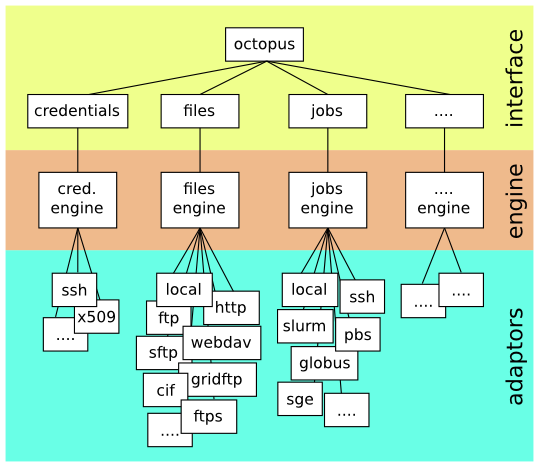

Octopus
=======

Copyright 2013 The Netherlands eScience Center

Author: Jason Maassen (<J.Maassen@esciencecenter.nl>)

Version: Userguide v0.1, Octopus v0.9

Last modified: 27 June 2013

Copyrights & Disclaimers
------------------------

Octopus is copyrighted by the Netherlands eScience Center and releases under 
the Apache License, Version 2.0.

See the "LICENSE" and "NOTICE" files in the octopus distribution for more 
information. 

See <http://www.esciencecenter.nl> for more information on the Netherlands
eScience Center.

The octopus project web site can be found at 
<https://github.com/NLeSC/octopus>.

This product includes the SLF4J library, which is Copyright (c) 2004-2013 QOS.ch
See "notices/LICENSE.slf4j.txt" for the licence information of the SLF4J library. 

This product includes the JSch library, which is Copyright (c) 2002-2012 Atsuhiko 
Yamanaka, JCraft,Inc. See "notices/LICENSE.jsch.txt" for the licence information 
of the JSch library.

What is it?
-----------

Octopus is a middleware abstraction library. It provides a simple programming 
interface to various pieces of software that can be used to access distributed
compute and storage resources. 

TODO: mention Java!

Why Octopus?
------------

Octopus is developed by the Netherlands eScience Center as a support library 
for our projects. Several projects develop end-user applications that require 
access to distributed compute and storage resources. Octopus provides a simple 
API to those resources, allowing those applications to be developed more 
rapidly. The experience gained during end-user application development is used 
to improve the Octopus API and implementation. 

Installation
------------

TODO

Design
------

Octopus is designed with extensibility in mind. It uses a modular and layer design
as shown in Figure 1. 

	
Octopus consists of three layers, an *interface layer*, an *engine layer* and an 
*adaptor layer*. 

### Interface Layer ###

The interface layer is used by the application developer using octopus. It contains 
several specialized interfaces:

* Octopus: this is the main entry point used to retrieve the other interfaces. 
* Files: contains all functionality related to files, e.g., creation, deletion, 
  copying, reading, writing, obtaining directory listings, etc. 
* Jobs: contains all functionality related to job submission, e.g., submitting, 
  polling status, cancelling, etc. 
* Credentials: contains all functionality related to credentials. Credentials 
  (such as a username password combination) are often needed to gain access to 
  files or to submit jobs. 

The examples section below will show examples of how to use each of these interfaces.

The modular design of octopus allows us to add additional interfaces in later 
versions, e.g., a Clouds interface to manage virtual machines, or a Networks 
interface to manage bandwidth-on-demand networks. 

### Adaptor Layer ###

The adaptor layer contains the adaptors for the each of the middlewares that 
octopus supports. Each adaptor translates the functionality offered by one of the 
octopus interfaces to specific code. For example, when copying a file using *sftp*, 
the user simply invokes the *copy* function of the *file interface*. It is then the 
resposibility of the *sftp file adaptor* to implement this copy. It is up to the 
*engine layer* to select the correct adaptor, as described below.  

### Engine Layer ###

The engine layer of octopus contains the "glue" that connects each inteface to the 
adaptors that implement its functionality on a specific middleware. 
Many adaptors can exists for a single interface. Octopus uses schemes, such as "sftp" 
or "http", to identify the adaptors and select the correct adaptor to invoke when 
an inteface function is used. There can be only one adaptor for each scheme. 

Examples
--------

